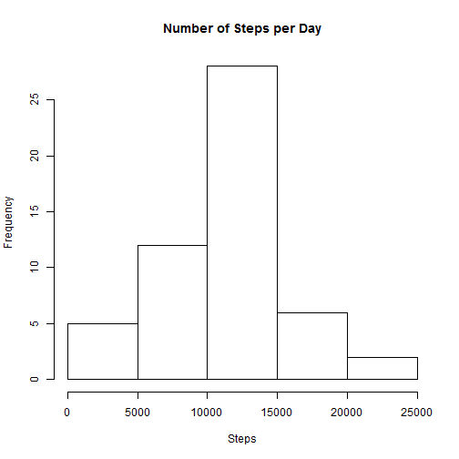
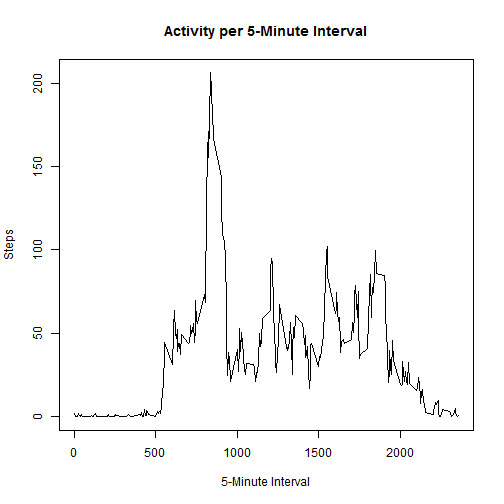
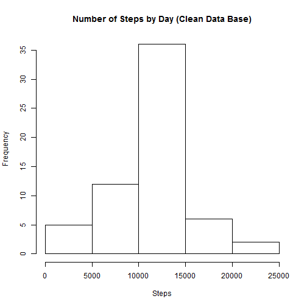
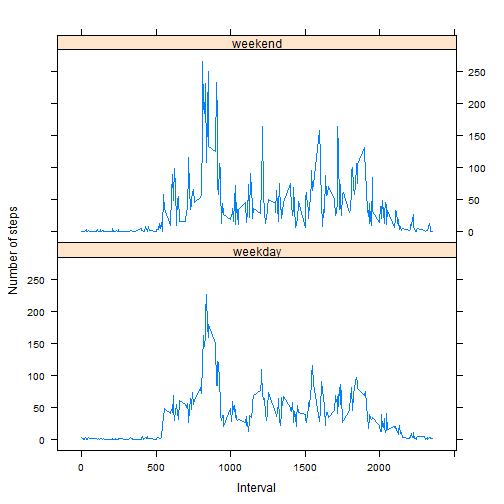

# Reproducible Research: Peer Assessment 1
==========================================
Author: Nahir Rodriguez 

Date: August 17, 2014

---


## Loading and preprocessing the data
Unzip and read the data.


```r
setwd("C:/Users/Nahir/Documents/RepData_PeerAssessment1")

unzip("activity.zip")

rawdb <- read.table("activity.csv",
                    header = T,sep = ",",na.strings = c("NA"),
                    colClasses = c("numeric","character","numeric"))

db <- rawdb
```

## What is mean total number of steps taken per day?
For this part of the assignment, you can ignore the missing values in the dataset.


```r
dbbydate <- aggregate(steps ~ date, data = db, FUN = "sum")
hist(dbbydate$steps,
     main = "Number of Steps per Day",
     xlab = "Steps")
```

 

```r
meansteps <- mean(dbbydate$steps, na.rm = FALSE)
print(meansteps)
```

[1] 10766

```r
mediansteps <- median(dbbydate$steps, na.rm = FALSE)
print(mediansteps)
```

[1] 10765

The mean total number of steps taken per day is 10766, while the median is 10765.


## What is the average daily activity pattern?
Make a time series plot  of the 5-minute interval and the average number of steps taken, averaged across all days


```r
dbdactivity <- aggregate(steps ~ interval, data = db, FUN = "mean")

plot(dbdactivity$interval, dbdactivity$steps,type = "l",
     main = "Activity per 5-Minute Interval",
     xlab = "5-Minute Interval",
     ylab = "Steps"
     )
```

 

```r
maxsteps <- max(dbdactivity$steps)
print(maxsteps)
```

[1] 206.2

```r
maxstepsinterval <- dbdactivity[which.max(dbdactivity$steps),c("interval")]
print(maxstepsinterval)
```

[1] 835

The 5-minute interval, which, on average across all the days in the dataset, contaied the maximum number of steps was 835 with 206.2 steps.

## Imputing missing values


```r
nadb <- rawdb[is.na(rawdb$steps) | 
                  is.na(rawdb$date) | 
                  is.na(rawdb$interval),]
narows <- nrow(nadb)
narows
```

[1] 2304

The total number of missing values in the dataset (i.e. the total number of rows with NAs) is 2304. To clean the data the corresponding mean of each 5-minute interval was used to replace NA values.


```r
completedb <- rawdb[!is.na(rawdb$steps) & 
                        !is.na(rawdb$date) & 
                        !is.na(rawdb$interval),]

nadb <- nadb[,c("date","interval")]
nadb <- merge(nadb,dbdactivity,by="interval")

completedb2 <- rbind(completedb,nadb)

cleandb <- merge(rawdb[,c(c("date","interval"))],completedb2,by=c("date","interval"),sort = FALSE)

nrow(cleandb)
```

[1] 17568

```r
nrow(nadb)+nrow(completedb)
```

[1] 17568

```r
cleandbbydate <- aggregate(steps ~ date, data = cleandb, FUN = "sum")

hist(cleandbbydate$steps,
     main = "Number of Steps by Day (Clean Data Base)",
     xlab = "Steps")
```

 

```r
cleanmeansteps <- mean(cleandbbydate$steps, na.rm = FALSE)
print(cleanmeansteps)
```

[1] 10766

```r
cleanmediansteps <- median(cleandbbydate$steps, na.rm = FALSE)
print(cleanmediansteps)
```

[1] 10766

Note that using the mean for that 5-minute interval to repalce NA values, the mean total number of steps taken per day is 10766.19, while the median is 10766.19. Very similar to the results with NA values included.


## Are there differences in activity patterns between weekdays and weekends?


```r
cleandb$day <- weekdays(as.Date(cleandbbydate$date,"%Y-%m-%d"))

cleandb$daytype <- ""

cleandb[cleandb$day %in% c("Monday","Tuesday","Wednesday","Thursday","Friday"),c("daytype")] <- "weekday"
cleandb[cleandb$day %in% c("Saturday","Sunday"),c("daytype")] <- "weekend"

dbdactivity <- aggregate(steps ~ interval + daytype, data = cleandb, FUN = "mean")


library(lattice)
xyplot(steps ~ interval | daytype, 
       data = dbdactivity, 
       layout = c(1, 2),
       type="a",
       xlab = "Interval",
       ylab = "Number of steps")
```

 

There are differences in activity patterns between weekdays and weekends as seen in the graph above.
